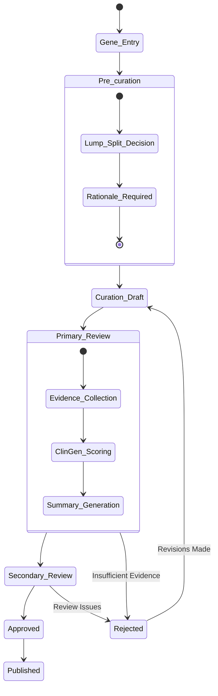

# Gene Curator - Workflow Documentation

## Overview

Gene Curator implements a comprehensive gene-disease curation workflow that follows ClinGen Standard Operating Procedures (SOP v11). This document details the complete workflow from gene entry through final publication, including state transitions, user roles, and data transformations.

## Workflow States & Transitions



## Complete Workflow Process

### Stage 1: Gene Entry

**Purpose**: Establish the gene registry with HGNC-compliant information

**Data Required**:
- HGNC ID (validated format: HGNC:#####)
- Approved gene symbol
- Chromosomal location
- Previous/alias symbols (optional)
- Gene family information (optional)

**User Roles**: Curator, Admin

**Database Operations**:
```sql
INSERT INTO genes (
    hgnc_id, approved_symbol, chromosome, location,
    previous_symbols, alias_symbols, details,
    details, created_by
) VALUES (...);
```

**Business Rules**:
- HGNC ID must be unique and follow format validation
- Approved symbol must match HGNC registry
- Content hash generated for integrity verification

### Stage 2: Pre-curation

**Purpose**: Define the disease entity and make lumping/splitting decisions

**Data Required**:
- Gene selection (from registry)
- MONDO ID (disease ontology identifier)
- Mode of inheritance (AR, AD, XL, etc.)
- Lumping/splitting decision
- Rationale (required for Lump or Split decisions)

**User Roles**: Curator, Admin

**Workflow States**:
- `Draft` → `In_Primary_Review` → `In_Secondary_Review` → `Approved` → `Published`

**Database Operations**:
```sql
INSERT INTO precurations (
    gene_id, mondo_id, mode_of_inheritance,
    lumping_splitting_decision, rationale,
    status, details, created_by
) VALUES (...);
```

**Business Rules**:
- MONDO ID must be validated against ontology
- Rationale required if decision is not 'Undecided'
- Minimum 50 characters for rationale

#### Lumping/Splitting Logic

**Lump Decision**: Multiple disease names/phenotypes represent the same genetic condition
- Rationale must explain why entities should be combined
- Evidence should demonstrate shared genetic mechanism

**Split Decision**: What appears to be one condition represents multiple distinct entities
- Rationale must explain criteria for separation
- Evidence should demonstrate distinct genetic mechanisms

**Undecided**: More evidence needed for determination
- Rationale optional but recommended
- Can proceed to curation with uncertainty noted

### Stage 3: Curation (ClinGen SOP v11 Core)

**Purpose**: Collect and score evidence according to ClinGen standards

**Data Required**:
- Gene-disease association (from pre-curation)
- Evidence collection across multiple categories
- ClinGen scoring and verdict assignment
- Evidence summary generation

**User Roles**: Curator (evidence entry), Admin (approval)

#### Evidence Collection Categories

##### 3.1 Genetic Evidence (Maximum 12 points)

**Case-Level Data** (Maximum 12 points total):
```json
{
  "case_level_data": [
    {
      "pmid": "12345678",
      "proband_label": "Smith et al, Proband 1",
      "variant_type": "Predicted or Proven Null",
      "is_de_novo": true,
      "points": 2.0,
      "rationale": "De novo null variant in highly constrained gene"
    }
  ]
}
```

**Segregation Data** (Maximum 3 points total):
```json
{
  "segregation_data": [
    {
      "pmid": "87654321",
      "family_label": "Jones et al, Family A",
      "lod_score_published": 3.2,
      "points": 2.0,
      "rationale": "Published LOD score meets threshold"
    }
  ]
}
```

**Case-Control Data** (Maximum 6 points total):
```json
{
  "case_control_data": [
    {
      "pmid": "11223344",
      "study_type": "Aggregate",
      "odds_ratio": 4.9,
      "confidence_interval": "1.4-17.7",
      "p_value": 0.015,
      "points": 2.0,
      "rationale": "Significant association, controls from population database"
    }
  ]
}
```

##### 3.2 Experimental Evidence (Maximum 6 points)

**Function Evidence**:
```json
{
  "function": [
    {
      "type": "Biochemical Function",
      "pmid": "55566677",
      "description": "Enzyme assay demonstrated loss of catalytic activity",
      "points": 0.5,
      "methodology": "In vitro enzyme kinetics"
    }
  ]
}
```

**Model Systems Evidence**:
```json
{
  "models": [
    {
      "type": "Non-human model organism",
      "pmid": "88899900",
      "description": "Zebrafish model recapitulated cardiac defects",
      "points": 2.0,
      "organism": "Danio rerio"
    }
  ]
}
```

**Rescue Evidence**:
```json
{
  "rescue": [
    {
      "type": "Rescue in human",
      "pmid": "11122233",
      "description": "Enzyme replacement therapy showed clinical improvement",
      "points": 2.0,
      "treatment_type": "Enzyme replacement"
    }
  ]
}
```

#### ClinGen Scoring Engine

**Automated Score Calculation**:
The database automatically calculates scores using triggers:

```sql
-- Applied maximums per SOP v11:
genetic_score := LEAST(
    LEAST(case_level_total, 12.0) + 
    LEAST(segregation_total, 3.0) + 
    LEAST(case_control_total, 6.0),
    12.0  -- Overall genetic evidence maximum
);

experimental_score := LEAST(experimental_total, 6.0);
total_score := genetic_score + experimental_score; -- Maximum 18
```

#### Verdict Assignment Logic

| Total Score | Contradictory Evidence | Verdict |
|-------------|------------------------|---------|
| ≥12         | No                     | Definitive |
| 7-11        | No                     | Strong |
| 4-6         | No                     | Moderate |
| 1-3         | No                     | Limited |
| 0           | No                     | No Known Disease Relationship |
| Any         | Yes                    | Disputed |
| N/A         | Refuting Evidence      | Refuted |

### Stage 4: Review and Approval Workflow

#### Primary Review
**Performed by**: Senior Curator or designated reviewer
**Focus**: 
- Evidence quality and completeness
- ClinGen compliance validation
- Score accuracy verification
- Summary generation review

**Actions Available**:
- Approve → Move to Secondary Review
- Request Changes → Return to Draft with comments
- Reject → Mark as insufficient evidence

#### Secondary Review
**Performed by**: Admin or expert panel member
**Focus**:
- Scientific accuracy
- Literature interpretation
- Methodology validation
- Final quality assurance

**Actions Available**:
- Approve → Ready for publication
- Request Changes → Return to Primary Review
- Reject → Mark for major revision

#### Final Approval and Publication
**Performed by**: Admin
**Requirements**:
- Both reviews completed successfully
- All evidence properly attributed
- Summary meets ClinGen template standards
- Ready for GenCC submission

## User Roles and Permissions

### Viewer
**Permissions**:
- Read access to all published curations
- View gene registry
- Access public dashboards and statistics

**Restrictions**:
- Cannot create or modify any records
- Cannot access draft or review-stage content

### Curator
**Permissions**:
- Create and edit genes, pre-curations, and curations
- Submit items for review
- View all content (including drafts)
- Generate evidence summaries

**Restrictions**:
- Cannot approve reviews
- Cannot publish final curations
- Cannot modify approved content

### Admin
**Permissions**:
- All curator permissions
- Approve and reject reviews
- Publish final curations
- User management
- System configuration
- Access to audit logs

**Responsibilities**:
- Quality assurance oversight
- Review workflow management
- Scientific validation
- Publication decisions

## Data Transformations

### Gene → Pre-curation
```sql
-- Data inherited from gene registry
SELECT 
    g.id as gene_id,
    g.approved_symbol,
    g.hgnc_id,
    g.details
FROM genes g
WHERE g.id = :selected_gene_id;

-- Additional pre-curation data
INSERT INTO precurations (
    gene_id,
    mondo_id,           -- New: Disease association
    mode_of_inheritance, -- New: Inheritance pattern
    lumping_splitting_decision, -- New: Entity definition
    rationale           -- New: Scientific justification
);
```

### Pre-curation → Curation
```sql
-- Core data inherited from pre-curation
SELECT 
    p.gene_id,
    p.mondo_id,
    p.mode_of_inheritance,
    p.lumping_splitting_decision,
    p.rationale
FROM precurations p
WHERE p.id = :precuration_id AND p.status = 'Approved';

-- Enhanced curation data
INSERT INTO curations (
    gene_id,
    precuration_id,
    mondo_id,           -- Inherited
    mode_of_inheritance, -- Inherited
    disease_name,       -- New: Human readable name
    verdict,            -- New: ClinGen classification
    gcep_affiliation,   -- New: Expert panel
    details             -- New: Complete evidence structure
);
```

### Evidence Structure Evolution
```json
// Pre-curation details (minimal)
{
  "rationale": "Text explanation of lumping/splitting decision",
  "supporting_literature": ["PMID1", "PMID2"],
  "confidence_level": "High"
}

// Curation details (comprehensive)
{
  "genetic_evidence": {
    "case_level_data": [...],
    "segregation_data": [...],
    "case_control_data": [...]
  },
  "experimental_evidence": {
    "function": [...],
    "models": [...],
    "rescue": [...]
  },
  "contradictory_evidence": [...],
  "external_evidence": [...],
  "curation_workflow": {
    "review_log": [...],
    "flags": {...},
    "compliance_status": "Validated"
  }
}
```

## Workflow Automation

### Automated Processes

#### Score Calculation
- Triggered on every curation insert/update
- Validates evidence point assignments
- Applies ClinGen SOP v11 maximums
- Updates verdict based on total score

#### Summary Generation
- Template-driven text generation
- Follows ClinGen Evidence Summary Template v5.1
- Incorporates all evidence categories
- Updates automatically with evidence changes

#### Integrity Verification
- SHA-256 content hashing
- Version chaining with previous_hash
- Audit trail generation
- Provenance tracking

### Notification System

#### Review Notifications
```json
{
  "trigger": "status_change",
  "from_status": "Draft",
  "to_status": "In_Primary_Review",
  "notify": ["primary_reviewer", "created_by"],
  "template": "review_requested"
}
```

#### Approval Notifications
```json
{
  "trigger": "approval",
  "entity_type": "curation",
  "notify": ["created_by", "all_reviewers", "gcep_lead"],
  "template": "curation_approved"
}
```

## Quality Assurance

### Validation Rules

#### Data Quality Checks
- PMID format validation (numeric only)
- Evidence point ranges (e.g., case-level ≤ 12)
- Required field completeness
- Citation accessibility verification

#### Scientific Validation
- Evidence-verdict consistency checking
- Literature citation verification
- Methodology appropriateness review
- Conflicting evidence identification

#### ClinGen Compliance
- SOP v11 scoring rule enforcement
- Evidence category completeness
- Summary template adherence
- Classification threshold validation

### Review Criteria

#### Primary Review Checklist
- [ ] All evidence properly cited with PMIDs
- [ ] Point assignments follow SOP v11 guidelines
- [ ] Evidence descriptions are clear and accurate
- [ ] Contradictory evidence properly acknowledged
- [ ] Summary generation is complete and accurate

#### Secondary Review Checklist
- [ ] Scientific methodology is sound
- [ ] Literature interpretation is appropriate
- [ ] Classification is supported by evidence
- [ ] No conflicts of interest identified
- [ ] Ready for professional publication

## Performance Considerations

### Workflow Optimization
- **Parallel Processing**: Evidence entry can occur simultaneously across categories
- **Real-time Validation**: Client-side validation prevents submission errors
- **Incremental Saves**: Draft auto-save prevents data loss
- **Background Processing**: Summary generation doesn't block user interaction

### Database Performance
- **JSONB Indexing**: Fast queries on evidence structures
- **Computed Columns**: Pre-calculated scores for sorting and filtering
- **View Materialization**: Complex workflow queries pre-computed
- **Connection Pooling**: Efficient database resource utilization

## Error Handling and Recovery

### Common Error Scenarios

#### Evidence Entry Errors
- **Invalid PMID**: Client-side validation with PubMed API check
- **Point Overflow**: Real-time calculation prevents SOP v11 violations
- **Missing Citations**: Required field validation before submission
- **Format Errors**: Pydantic schema validation at API level

#### Workflow State Errors
- **Invalid Transitions**: Database constraints prevent illegal state changes
- **Permission Violations**: RBAC enforcement at API and database levels
- **Concurrent Modifications**: Optimistic locking with version checking
- **Data Corruption**: Content hash verification detects tampering

### Recovery Procedures

#### Draft Recovery
```sql
-- Restore from audit log
SELECT changes FROM change_log 
WHERE entity_id = :curation_id 
AND operation = 'UPDATE'
ORDER BY timestamp DESC LIMIT 1;
```

#### Version Rollback
```sql
-- Find previous version using hash chain
SELECT * FROM curations 
WHERE record_hash = (
    SELECT previous_hash FROM curations WHERE id = :current_id
);
```

---

## Integration Points

### External Systems

#### HGNC Registry
- Gene symbol validation
- Periodic synchronization
- New gene notifications

#### MONDO Ontology
- Disease identifier validation
- Ontology term lookup
- Relationship mapping

#### PubMed Integration
- Citation validation
- Abstract retrieval
- Author information

#### GenCC Submission
- Final curation export
- Classification submission
- Update notifications

### API Integration Points
```python
# Gene validation
GET /api/v1/genes/validate/{hgnc_id}

# MONDO lookup
GET /api/v1/ontology/mondo/{mondo_id}

# Evidence scoring
POST /api/v1/curations/{id}/calculate-scores

# Summary generation
POST /api/v1/curations/{id}/generate-summary

# Workflow actions
POST /api/v1/curations/{id}/workflow/approve
POST /api/v1/curations/{id}/workflow/publish
```

## Monitoring and Analytics

### Workflow Metrics
- Average time in each workflow stage
- Review completion rates
- Evidence quality scores
- User activity patterns

### Scientific Metrics
- Classification distribution (Definitive, Strong, etc.)
- Evidence category usage
- Citation patterns
- Collaborative contribution tracking

### System Performance
- Database query performance
- API response times
- User interface responsiveness
- Background job completion rates

---

## Related Documentation

- [ClinGen Compliance](./CLINGEN_COMPLIANCE.md) - Detailed SOP v11 implementation
- [Database Schema](./DATABASE_SCHEMA.md) - Complete database structure
- [API Reference](./API_REFERENCE.md) - Workflow endpoint documentation
- [Frontend Guide](./FRONTEND_GUIDE.md) - User interface workflows
- [Architecture](./ARCHITECTURE.md) - Overall system design