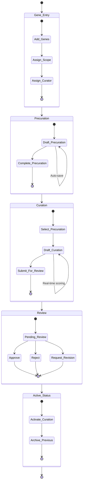

# Gene Curator - Workflow Documentation

## Overview

Gene Curator implements a **scope-based, schema-agnostic** gene-disease curation workflow that organizes work by clinical specialties while adapting to any scientific methodology through configurable schemas. This document details the comprehensive 5-stage workflow system with quality assurance through the 4-eyes principle.

## Core Architecture Principles

### 1. Scope-Based Organization
All curation work is organized by **clinical specialties** (scopes) such as:
- **kidney-genetics**: Kidney disease gene curation
- **cardio-genetics**: Cardiovascular disease genes
- **neuro-genetics**: Neurological disease genes
- **onco-genetics**: Cancer gene curation

### 2. Schema-Driven Methodology
Within each scope, workflows are **defined by schemas**, not hard-coded:
- **Field Definitions**: What data to collect (methodology-specific)
- **Validation Rules**: How to validate evidence data
- **Scoring Engines**: How to calculate verdicts/classifications
- **Workflow States**: Multi-stage progression with review gates
- **UI Generation**: Dynamic form rendering

### 3. Multi-Stage Quality Assurance
5-stage workflow with **4-eyes principle** ensuring scientific rigor:
1. **Gene/List Entry** → Scope assignment and curator allocation
2. **Precuration** → Disease entity definition and initial assessment
3. **Curation** → Evidence collection and scoring (requires precuration)
4. **Review** → Independent peer review by different curator (mandatory)
5. **Active Status** → One active curation per gene-scope (others archived)

### 4. Multi-Curation Support
- **Multiple precurations** per gene-scope combination
- **Multiple curations** per gene-scope (each must reference a precuration)
- **One active curation** per gene-scope (automatic archiving of previous)
- **Complete audit trail** of all curation versions and status changes

## 5-Stage Scope-Based Workflow



## Stage 1: Gene/Gene List Entry with Scope Assignment

**Purpose**: Establish gene registry with clinical specialty assignment and curator allocation

### Core Operations

#### A. Gene Entry
- **HGNC Validation**: Ensure HGNC ID format compliance (HGNC:#####)
- **Gene Information**: Approved symbol, chromosomal location, aliases
- **Bulk Import**: Support CSV/batch gene list uploads
- **Duplicate Detection**: Prevent duplicate gene entries

#### B. Scope Assignment
- **Clinical Specialty Selection**: Assign genes to appropriate scopes
  - kidney-genetics, cardio-genetics, neuro-genetics, etc.
- **Institution Mapping**: Link to institutional scope ownership
- **Default Workflow**: Each scope has default precuration + curation schema pair
- **Multi-Scope Support**: Genes can be assigned to multiple scopes

#### C. Curator Assignment
- **Scope-Based Assignment**: Curators work within their specialty domains
- **Load Balancing**: Distribute work across available curators
- **Expertise Matching**: Consider curator specialization
- **Optional Assignment**: Can be assigned later or self-selected

### Database Operations
```sql
-- Gene-scope assignment with curator allocation
INSERT INTO gene_scope_assignments (
    gene_id,
    scope_id,
    assigned_curator_id,
    assigned_by,
    assigned_at
) VALUES (...);
```

### Workflow Outputs
- **Gene-Scope Pairs**: Established for subsequent workflow stages
- **Curator Assignments**: Work allocation within clinical specialties
- **Audit Trail**: Complete record of assignment decisions and timing

## Stage 2: Precuration (Multiple per Gene-Scope)

**Purpose**: Define disease entity and initial assessment within clinical specialty scope

### Multiple Precuration Support
- **Per Gene-Scope**: Multiple precurations allowed for each gene-scope combination
- **Different Approaches**: Various disease entity definitions or methodologies
- **Comparative Analysis**: Multiple precurators can provide different perspectives
- **Quality Through Diversity**: Enhanced scientific rigor through multiple viewpoints

### Core Precuration Elements

#### Universal Elements (Scope-Agnostic)
- **Gene-Scope Reference**: Links to assigned gene-scope pair
- **Disease Ontology**: MONDO, OMIM, HPO identifiers
- **Mode of Inheritance**: Autosomal dominant/recessive, X-linked, etc.
- **Clinical Specialty Context**: Scope-specific disease categorization

#### Schema-Driven Elements (Methodology-Specific)
- **Precuration Schema**: Defines fields and validation for chosen methodology
- **Lumping/Splitting Decisions**: Disease entity definition approach
- **Initial Literature Review**: Preliminary evidence assessment
- **Confidence Level**: Initial assessment of gene-disease relationship

### Draft Management and Auto-Save
- **Draft State Persistence**: Work-in-progress automatically saved
- **Auto-Save Timestamps**: Regular saves with user activity tracking
- **Resume Functionality**: Continue work from any point
- **Version History**: Track changes during precuration development

### Precuration Completion
- **Validation Check**: Schema-defined completeness requirements
- **Quality Gate**: Ensure precuration meets minimum standards
- **Available for Curation**: Completed precurations become selectable for curation stage
- **Audit Trail**: Complete record of precuration development and completion

### Database Operations
```sql
INSERT INTO precurations (
    gene_id,
    scope_id,
    precuration_schema_id,
    status,               -- draft, completed
    is_draft,
    evidence_data,        -- Flexible JSONB for any precuration structure
    auto_saved_at,
    created_by
) VALUES (...);
```

## Stage 3: Curation (Multiple per Gene-Scope, Requires Precuration)

**Purpose**: Comprehensive evidence collection and scoring within clinical specialty scope

### Multi-Curation Architecture
- **Precuration Dependency**: Each curation MUST reference a completed precuration
- **Multiple Curations**: Multiple curations allowed per gene-scope combination
- **Comparative Analysis**: Different curators can provide different evidence perspectives
- **Active/Archived System**: Only one curation can be active per gene-scope at a time

### Schema-Driven Curation Process

#### 1. Precuration Selection
- **Required Dependency**: Must select from completed precurations for the gene-scope
- **Precuration Context**: Inherits disease entity definition and initial assessments
- **Data Mapping**: Schema-defined field mappings from precuration to curation

#### 2. Evidence Collection (Methodology-Specific)
- **Dynamic Forms**: UI generated from curation schema field definitions
- **Real-time Validation**: Schema validation rules applied continuously
- **Auto-Save Functionality**: Draft states preserved with timestamps
- **Evidence Structure**: Flexible JSONB storage adapts to any methodology

#### 3. Real-Time Scoring
- **Scoring Engine Selection**: Based on schema scoring configuration
- **Live Updates**: Scores recalculated as evidence is entered
- **Verdict Determination**: Classifications computed according to methodology rules
- **Score Breakdown**: Detailed evidence category contributions

#### 4. Draft Management
- **Work-in-Progress Persistence**: Comprehensive draft state management
- **Auto-Save Intervals**: Regular automatic saving with user activity tracking
- **Resume Capability**: Continue work from any interruption point
- **Version Tracking**: Complete history of curation development

**Example Evidence Structures**:

#### ClinGen Methodology
```json
{
  "genetic_evidence": {
    "case_level_data": [...],
    "segregation_data": [...],
    "case_control_data": [...]
  },
  "experimental_evidence": {
    "function": [...],
    "models": [...],
    "rescue": [...]
  }
}
```

#### GenCC-Based Methodology
```json
{
  "clinical_evidence": {
    "phenotype_overlap": "complete|partial|minimal",
    "inheritance_pattern": "consistent|inconsistent",
    "population_data": 7.5
  },
  "literature_evidence": {
    "study_quality": "high|medium|low",
    "evidence_strength": "strong|moderate|weak"
  }
}
```

#### Custom Institutional Methodology
```json
{
  "institutional_assessment": {
    "expert_review": "positive|negative|uncertain",
    "confidence_level": 8.2,
    "committee_consensus": true
  }
}
```

## Stage 4: Review Process (4-Eyes Principle)

**Purpose**: Independent peer review ensuring scientific rigor and quality assurance

### 4-Eyes Principle Implementation

#### Mandatory Different Reviewer
- **Reviewer Assignment**: Must be different from curation creator
- **Scope Expertise**: Reviewer must have access to the same clinical specialty scope
- **Independence Requirement**: No collaboration during curation development
- **Quality Assurance**: Independent assessment of scientific validity

#### Review Assignment Process
- **Automatic Assignment**: System can auto-assign available reviewers within scope
- **Manual Assignment**: Curators can request specific reviewers
- **Load Balancing**: Distribute review workload across scope reviewers
- **Expertise Matching**: Consider reviewer specialization within clinical scope

### Review Actions and Outcomes

#### 1. Approve Curation
- **Quality Validation**: Evidence meets scientific standards
- **Score Verification**: Scoring calculations are accurate
- **Methodology Compliance**: Follows chosen schema requirements
- **Immediate Activation**: Option to activate curation upon approval

#### 2. Reject Curation
- **Insufficient Evidence**: Evidence doesn't meet minimum standards
- **Scoring Errors**: Calculation or classification problems
- **Return to Draft**: Curation returned to creator for revision
- **Detailed Feedback**: Specific reasons for rejection provided

#### 3. Request Revision
- **Partial Approval**: Good foundation but needs specific improvements
- **Targeted Feedback**: Specific areas requiring additional work
- **Collaborative Improvement**: Guided enhancement rather than rejection
- **Re-Review Required**: Additional review after revisions completed

### Review Quality Metrics
- **Review Duration Tracking**: Time from assignment to completion
- **Review Quality Assessment**: Accuracy of reviewer feedback
- **Consensus Tracking**: Agreement rates between curators and reviewers
- **Scope-Based Analytics**: Review performance within clinical specialties

## Stage 5: Active Status Management

**Purpose**: Maintain one authoritative curation per gene-scope with complete archival system

### Active Curation System

#### One Active Per Gene-Scope
- **Unique Constraint**: Only one active curation allowed per gene-scope combination
- **Automatic Archiving**: Previous active curation automatically archived when new one activated
- **Status Transition**: Approved curations can become active
- **Manual Override**: Administrators can change active status as needed

#### Activation Process
- **Review Completion**: Curation must be approved through 4-eyes principle
- **Quality Gate**: Final validation before activation
- **Previous Archiving**: Current active curation moved to archived status
- **Audit Trail**: Complete record of activation decisions and timing

#### Archive Management
- **Historical Preservation**: All previous curations maintained in archive
- **Version History**: Complete timeline of curation evolution
- **Accessibility**: Archived curations remain accessible for reference
- **Comparison Tools**: Compare active vs. archived curations

### Database Operations
```sql
-- Active curation management
INSERT INTO active_curations (
    gene_id,
    scope_id,
    curation_id,
    activated_at,
    activated_by,
    replaced_curation_id    -- Previous active curation (now archived)
) VALUES (...);

-- Automatic archiving trigger
UPDATE active_curations 
SET archived_at = NOW(), archived_by = ?
WHERE gene_id = ? AND scope_id = ? AND archived_at IS NULL;
```

## Dynamic Scoring System

### Scope-Aware, Schema-Driven Score Calculation

The system automatically selects appropriate scoring engines based on scope's default workflow pair or curation-specific schema:

```sql
-- Database trigger that adapts to any methodology within scope context
CREATE OR REPLACE FUNCTION calculate_dynamic_scores()
RETURNS TRIGGER AS $$
DECLARE
    schema_config JSONB;
    scoring_engine VARCHAR(100);
    scope_context JSONB;
BEGIN
    -- Get scope context and scoring configuration
    SELECT 
        cs.scoring_configuration,
        s.name as scope_name,
        s.institution
    INTO schema_config, scope_context
    FROM curation_schemas cs
    JOIN workflow_pairs wp ON wp.curation_schema_id = cs.id
    JOIN scopes s ON s.id = NEW.scope_id
    WHERE wp.id = NEW.workflow_pair_id;
    
    scoring_engine := schema_config->>'engine';
    
    -- Call methodology-specific scoring function with scope context
    CASE scoring_engine
        WHEN 'clingen_sop_v11' THEN
            NEW.computed_scores := calculate_clingen_scores(
                NEW.evidence_data, 
                schema_config, 
                scope_context
            );
        WHEN 'gencc_based' THEN
            NEW.computed_scores := calculate_gencc_scores(
                NEW.evidence_data, 
                schema_config, 
                scope_context
            );
        WHEN 'qualitative_assessment' THEN
            NEW.computed_scores := calculate_qualitative_scores(
                NEW.evidence_data, 
                schema_config, 
                scope_context
            );
        -- Scope-specific custom engines
        ELSE
            RAISE EXCEPTION 'Unknown scoring engine: % for scope: %', 
                scoring_engine, scope_context->>'scope_name';
    END CASE;
    
    RETURN NEW;
END;
$$ LANGUAGE plpgsql;
```

### Scoring Engine Examples

#### ClinGen Engine (preserves existing logic)
- **Genetic Evidence**: Max 12 points (case-level, segregation, case-control)
- **Experimental Evidence**: Max 6 points (function, models, rescue)
- **Verdicts**: Definitive, Strong, Moderate, Limited, etc.

#### GenCC Engine
- **Confidence Scoring**: Phenotype overlap + inheritance consistency + population data
- **Verdicts**: Definitive, Strong, Moderate, Limited

#### Qualitative Engine
- **Assessment Categories**: Clinical evidence, literature review, expert consensus
- **Verdicts**: Strong Association, Moderate Association, Weak Association

## User Roles and Scope-Based Permissions

### Scope-Based Access Control

User permissions are organized by clinical specialty scopes with methodology flexibility:

```json
{
  "user_scope_permissions": {
    "curator": {
      "assigned_scopes": ["kidney-genetics", "cardio-genetics"],
      "scope_permissions": {
        "kidney-genetics": {
          "precuration": ["create", "edit", "complete"],
          "curation": ["create", "edit", "submit_for_review"],
          "review": ["approve", "reject", "request_revision"],
          "methodologies": ["clingen_sop_v11", "custom_institutional"]
        },
        "cardio-genetics": {
          "precuration": ["create", "edit"],
          "curation": ["create", "edit"],
          "review": [],
          "methodologies": ["gencc_based"]
        }
      }
    }
  }
}
```

### Role Hierarchy

#### Viewer
- **Read Access**: Published curations across all scopes
- **No Scope Restrictions**: Can view any clinical specialty
- **Methodology Agnostic**: Access to all methodology types

#### Curator
- **Scope Assignment**: Assigned to specific clinical specialties
- **Multi-Stage Access**: Precuration, curation, and review within assigned scopes
- **4-Eyes Compliance**: Cannot review own curations
- **Methodology Selection**: Use any methodology within scope permissions

#### Admin
- **Universal Access**: All scopes and methodologies
- **Scope Management**: Create and manage clinical specialty scopes
- **Schema Management**: Create and modify methodology schemas
- **User Assignment**: Assign curators to scopes
- **Active Status Override**: Manually change active curations

## Data Flow and Transformations

### 5-Stage Scope-Based Data Flow

```
Gene Entry + Scope Assignment
     ↓
Multiple Precurations (per gene-scope)
     ↓
Multiple Curations (per gene-scope, require precuration reference)
     ↓
4-Eyes Principle Review (different reviewer required)
     ↓
Active Status Management (one active per gene-scope)
     ↓
Scope-Based Publication and Archival
```

### Multi-Curation Data Relationships

```
Gene (1) ──→ Gene-Scope Assignments (N)
             │
             └──→ Precurations (N per gene-scope)
                  │
                  └──→ Curations (N per gene-scope)
                       │
                       └──→ Reviews (1 per curation)
                            │
                            └──→ Active Status (0..1 per gene-scope)
```

### Scope-Aware Data Transformation

Data flows between stages with scope context and schema-defined mappings:

```json
{
  "scope_data_mapping": {
    "kidney-genetics": {
      "default_workflow_pair": "ClinGen_Complete",
      "precuration_to_curation": {
        "field_mappings": {
          "mondo_id": "disease_identifier",
          "mode_of_inheritance": "inheritance_pattern",
          "lumping_splitting_decision": "disease_entity_approach",
          "scope_context": "clinical_specialty"
        },
        "scope_specific_fields": {
          "kidney_phenotype_codes": "hpo_terms",
          "renal_function_metrics": "clinical_measurements"
        }
      }
    },
    "cardio-genetics": {
      "default_workflow_pair": "GenCC_Complete",
      "precuration_to_curation": {
        "field_mappings": {
          "disease_name": "phenotype_label",
          "inheritance_mode": "inheritance_pattern"
        },
        "scope_specific_fields": {
          "cardiac_phenotype_codes": "hpo_terms",
          "ecg_findings": "clinical_measurements"
        }
      }
    }
  }
}
```

## Workflow Automation

### Scope-Based, Multi-Stage Automation

#### Auto-Save and Draft Management
- **Real-Time Persistence**: Evidence data automatically saved during entry
- **User Activity Tracking**: Save triggers based on typing, clicks, and navigation
- **Resume Capability**: Users can resume work from any interruption point
- **Version History**: Complete record of draft evolution with timestamps

#### Dynamic Score Calculation
- **Live Updates**: Scores recalculated as evidence is entered
- **Scope-Aware Engines**: Uses scoring engine from scope's default or selected workflow pair
- **Methodology Compliance**: Applies schema-specific rules and maximums
- **Real-Time Validation**: Immediate feedback on evidence quality and completeness

#### Review Assignment Automation
- **4-Eyes Compliance**: Automatically excludes curation creator from reviewer pool
- **Scope-Based Assignment**: Only assigns reviewers with access to relevant clinical specialty
- **Load Balancing**: Distributes review workload across available scope reviewers
- **Expertise Matching**: Considers reviewer specialization within clinical scope

#### Active Status Management
- **Automatic Archiving**: Previous active curation archived when new one approved
- **Status Transition Tracking**: Complete audit trail of activation decisions
- **Conflict Prevention**: Ensures only one active curation per gene-scope
- **Manual Override Support**: Admin ability to change active status when needed

#### Scope-Specific Notifications
- **Multi-Stage Alerts**: Notifications for precuration completion, curation submission, review requests
- **Scope-Based Routing**: Notifications sent to curators within relevant clinical specialty
- **4-Eyes Reminders**: Review assignment and deadline notifications
- **Active Status Changes**: Alerts when curations become active or archived

#### Summary Generation
- **Template System**: Adapts to methodology requirements within scope context
- **Scope-Specific Formatting**: Clinical specialty-appropriate summary formats
- **Auto-Updates**: Summaries regenerated when evidence or scores change
- **Multi-Methodology Support**: ClinGen, GenCC, or custom institutional templates

## Quality Assurance

### Multi-Stage Quality Gates

#### Stage 1: Gene Entry Quality
- **HGNC Validation**: Verified gene symbol and ID format
- **Scope Appropriateness**: Gene relevance to assigned clinical specialty
- **Duplicate Prevention**: Check for existing gene-scope assignments
- **Curator Qualification**: Verify curator access to assigned scope

#### Stage 2: Precuration Quality
- **Schema Compliance**: Field validation according to precuration schema
- **Disease Entity Validation**: MONDO/OMIM identifier verification
- **Scope Relevance**: Disease appropriateness for clinical specialty
- **Completeness Check**: Required field validation before completion

#### Stage 3: Curation Quality
- **Precuration Dependency**: Verify reference to completed precuration
- **Evidence Quality**: Schema-defined validation of evidence entries
- **Score Consistency**: Verify scoring engine calculations
- **Literature Validation**: PMID format and accessibility checks

#### Stage 4: Review Quality (4-Eyes Principle)
- **Reviewer Independence**: Enforce different reviewer requirement
- **Scope Expertise**: Verify reviewer access to clinical specialty
- **Review Completeness**: Ensure thorough evaluation of evidence and scoring
- **Feedback Quality**: Constructive and specific revision requests

#### Stage 5: Active Status Quality
- **Approval Verification**: Confirm 4-eyes principle completion
- **Archival Integrity**: Ensure previous active curation properly archived
- **Status Consistency**: Maintain one-active-per-gene-scope constraint

### Scope-Specific Quality Standards

#### Clinical Specialty Validation
- **Domain Expertise**: Evidence evaluation within clinical specialty context
- **Phenotype Consistency**: HPO term appropriateness for scope
- **Literature Relevance**: Publication relevance to clinical specialty
- **Methodology Appropriateness**: Schema suitability for scope requirements

### Universal Quality Standards
- **Data Integrity**: SHA-256 content addressing for all curation records
- **Complete Audit Trail**: Full history of all workflow stages and user actions
- **User Attribution**: Clear tracking of creator, reviewer, and approver for each stage
- **Version Control**: Comprehensive history of curation evolution
- **4-Eyes Compliance**: Mandatory independent review before activation

## Performance and Monitoring

### Multi-Stage, Scope-Based Analytics

The system tracks performance across clinical specialties and workflow stages:

#### Workflow Stage Metrics
- **Precuration Performance**: Time to completion, draft save frequency, schema compliance
- **Curation Development**: Evidence collection time, scoring accuracy, draft iterations
- **Review Efficiency**: Review assignment time, review completion time, feedback quality
- **Active Status Management**: Activation frequency, archival patterns, version evolution

#### Scope-Based Performance
- **Clinical Specialty Productivity**: Completion rates by scope (kidney-genetics, cardio-genetics, etc.)
- **Scope-Specific Quality**: Evidence quality scores within clinical specialties
- **Inter-Scope Collaboration**: Cross-specialty reviewer assignments and knowledge sharing
- **Methodology Adoption**: Schema usage patterns within different clinical specialties

#### 4-Eyes Principle Effectiveness
- **Review Quality Metrics**: Accuracy of reviewer feedback, revision request effectiveness
- **Independence Compliance**: Verification of different reviewer assignments
- **Review Turnaround Times**: Time from submission to review completion
- **Approval/Rejection Rates**: Success rates by scope and methodology

#### Multi-Curation Analytics
- **Curation Volume**: Number of curations per gene-scope combination
- **Active Status Patterns**: Frequency of active curation changes
- **Version Evolution**: Curation improvement patterns over time
- **Archive Utilization**: Historical curation reference patterns

#### Scientific Quality Metrics
- **Verdict Distribution**: Classification patterns by scope and methodology
- **Evidence Completeness**: Evidence category utilization across clinical specialties
- **Score Consistency**: Scoring accuracy across different curators and reviewers
- **Literature Quality**: Citation patterns and evidence source reliability

#### System Performance
- **Scope-Aware Query Optimization**: Database performance for clinical specialty-based queries
- **Multi-Stage Workflow Performance**: Stage transition times and bottleneck identification
- **Auto-Save Efficiency**: Draft persistence performance and storage optimization
- **Real-Time Scoring Performance**: Scoring engine speed across different methodologies
- **4-Eyes Assignment Performance**: Reviewer matching algorithm efficiency

## Integration Points

### External System Integration

The scope-based, multi-stage architecture supports comprehensive integration:

#### Gene/Disease Ontologies
- **HGNC Registry**: Universal gene symbol validation and metadata
- **MONDO Ontology**: Disease entity standardization across clinical specialties
- **OMIM Database**: Mendelian inheritance patterns and phenotype information
- **HPO Terms**: Scope-specific phenotype standardization (kidney, cardiac, neuro phenotypes)
- **Custom Institutional Ontologies**: Organization-specific disease classification systems

#### Literature and Evidence Systems
- **PubMed Integration**: Universal literature reference validation and metadata retrieval
- **Evidence Repositories**: Clinical specialty-specific evidence databases
- **Institutional Literature**: Internal research and evidence collections
- **Citation Management**: Automated reference formatting and validation

#### Classification and Submission Systems
- **GenCC Integration**: Scope-aware submission formatting for different clinical specialties
- **ClinVar Submission**: Gene-disease validity submissions with scope context
- **Institutional Databases**: Internal curation system integration
- **Professional Society Databases**: Clinical specialty-specific repositories

#### Collaboration and Communication
- **User Management Systems**: Integration with institutional identity providers
- **Notification Services**: Email, Slack, or custom alert systems for workflow events
- **Version Control Systems**: Git-based schema and configuration management
- **Analytics Platforms**: Performance monitoring and business intelligence integration

#### Quality Assurance Integration
- **Literature Validation Services**: Automated PMID verification and metadata retrieval
- **Evidence Quality Tools**: Citation analysis and evidence strength assessment
- **Peer Review Platforms**: Integration with external review management systems
- **Audit and Compliance**: Integration with institutional quality management systems

---

## Summary

This workflow documentation describes a **comprehensive scope-based, multi-stage curation platform** that:

- **Organizes work by clinical specialties** (kidney-genetics, cardio-genetics, etc.)
- **Implements rigorous 4-eyes quality assurance** with mandatory independent review
- **Supports multiple curations per gene-scope** with active/archived status management
- **Adapts to any scientific methodology** through configurable schemas
- **Provides complete audit trails** for all workflow stages and user actions
- **Enables draft persistence and resume functionality** throughout the multi-stage process
- **Maintains scientific rigor** while offering unprecedented flexibility

The system transforms gene-disease curation from a single-methodology approach into a universal platform that can serve any clinical specialty using any scientific approach, while maintaining the highest standards of quality through structured multi-stage workflows and peer review processes.