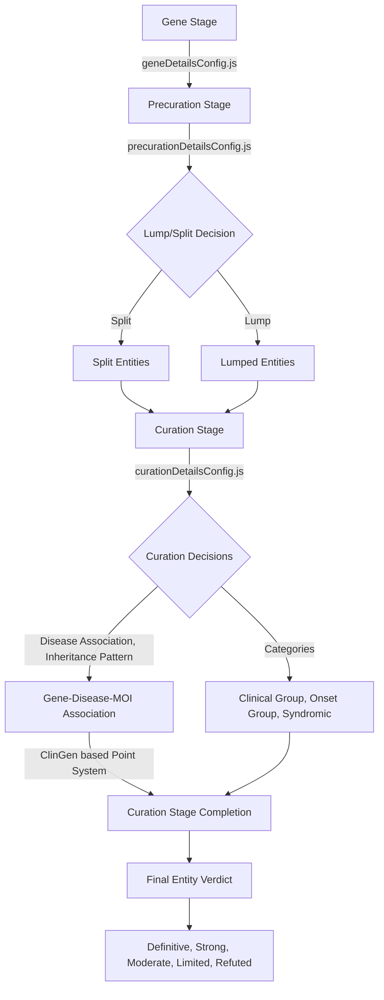

# High level workflow description

Following is the high level workflow for the gene curation process. The workflow is divided into 3 stages:

```mermaid
graph TD
    A[Gene Stage] -->|geneDetailsConfig.js| B[Precuration Stage]
    B -->|precurationDetailsConfig.js| C{Lump/Split Decision}
    C -->|Split| D[Split Entities]
    C -->|Lump| E[Lumped Entities]
    D --> F[Curation Stage]
    E --> F
    F -->|curationDetailsConfig.js| G{Curation Decisions}
    G -->|Disease Association, Inheritance Pattern| H[Gene-Disease-MOI Association]
    G -->|Categories| I[Clinical Group, Onset Group, Syndromic]
    H -->|ClinGen based Point System| J[Curation Stage Completion]
    I --> J
    J --> K[Final Entity Verdict]
    K --> L[Definitive, Strong, Moderate, Limited, Refuted]
```
